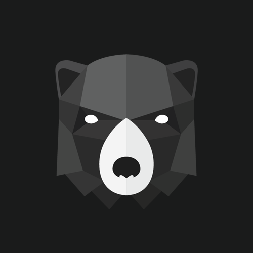
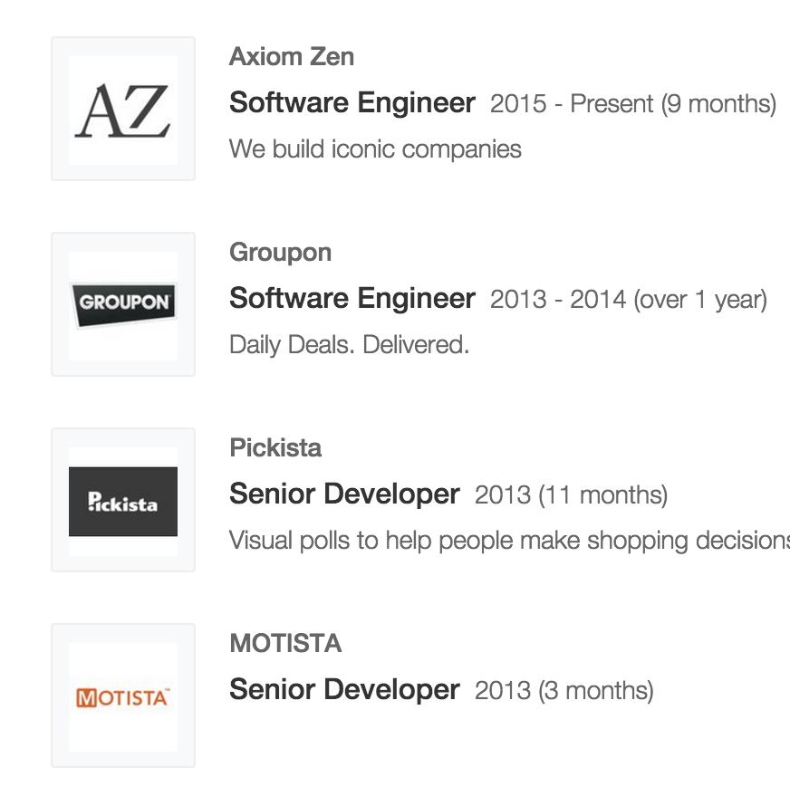
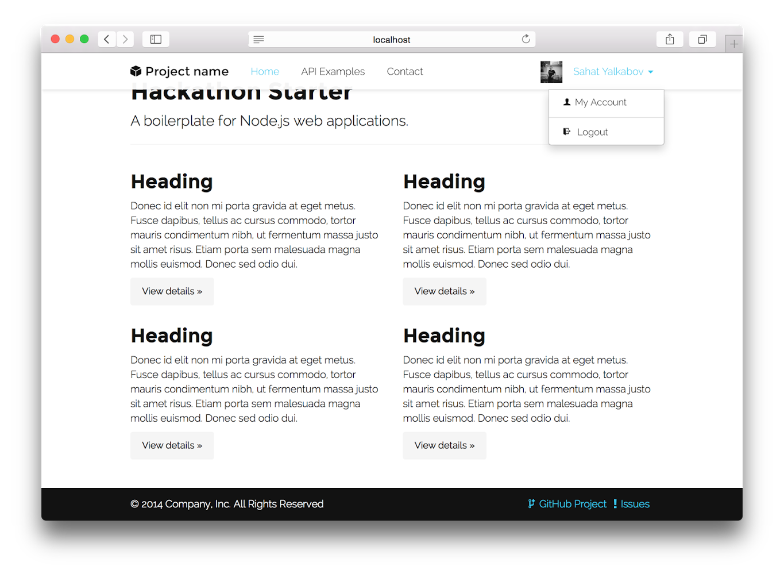
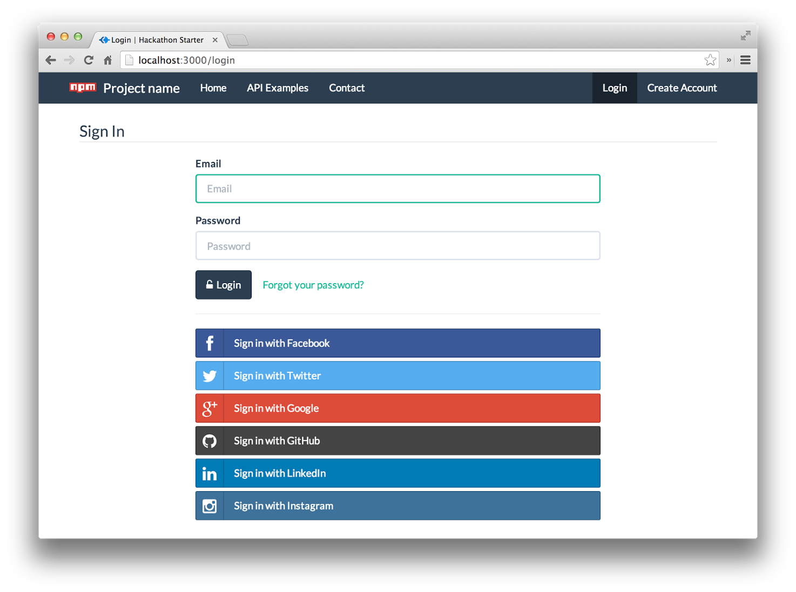
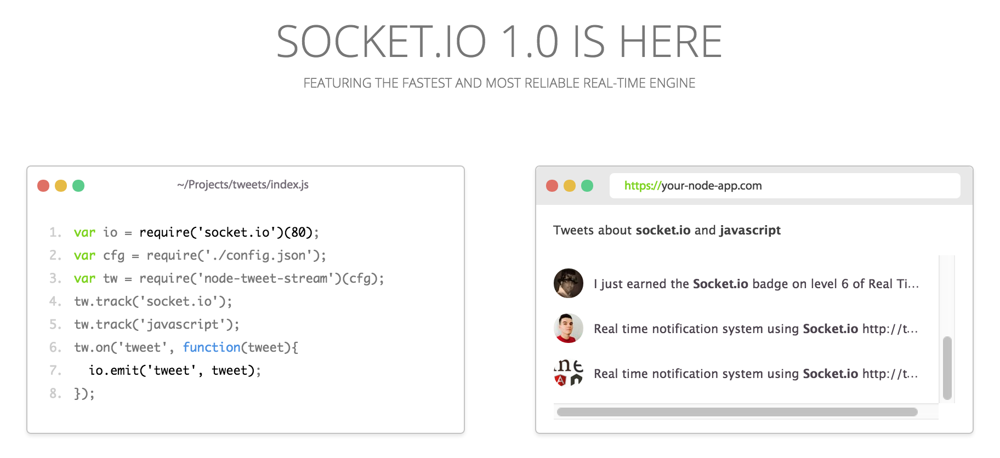

footer: © Axiom Zen Team, 2015
slidenumbers: true

# Un prototipo en 3 horas
Junior World Entrepreneurship Forum.

* Prototipo Funcional.
* Version Alpha.
* MVP.
* Analisis e implementacion en ejemplo:
	"Canal de chat volatil para empresas."

---

## El ponente

### Raul Pino

Ingeniero en Informatica (UCLA)

* 6 años de experiencia.
* Software Engineer en Axiom Zen y ex-Grouponer.

* Desarrollador Full Stack.
* Emprendedor.
* Participante destacado y organizador de hackathons.

---

## ¿Que es un __prototipo funcional__?

...

---

## __prototipo funcional__

* Caracteristicas realmente necesarias.
* El objetivo es mostrar la idea principal usando la menor cantidad de recursos (dinero, tiempo).
* Orientado a clientes, inversionistas, o posibles socios.

---

## ¿Que es una __version alpha__?

...

---

## Version Alpha

* Estable para personas fuera del equipo de desarrollo.
* Mostrar que el proyecto seria capaz de producir resultados.
* Orientado inversionistas que esten muy interesados en la idea.

---

## ¿Que es un __MVP__?

_¿Minimum Viable Product?_

...

---

## Minimum Viable Product

* Suficientemente estable como para lanzar al mercado (restringido o no).
* Se toman en cuenta aspetos mas profundos como seguridad y performance.
* Se omiten caracteristicas no relacionadas con el core del producto.

---

## Diferencias?

Se puede ver como las etapas de un producto:

1.- Prototipo Funcional. (*)

2.- Version Alpha.

3.- MVP.

---

## __prototipo funcional__

Ejemplo:

Crear una aplicacion para publicar fotos?

...

---

## __prototipo funcional__

Ejemplo:

Crear una aplicacion para publicar fotos?

* Login.
* Subir fotos a un repositorio comun.
* Ver fotos.

---

## ¿Cuando son utiles los prototipos?

__Hackathons! :D__

* Poco tiempo para desallorrar.
* Quizas 0 presupuesto.

---

## JWEF Hackathon 2015!

"Chat volatil para organizaciones"

* Hacer que los miembros compartan ideas en un lugar comun.
* Obtener informacion de perfiles de usuario externos a la organizacion.

_Volatile AxiomChat?_

---

## Volatile AxiomChat

Prototipo funcional?

* Login con Twitter, Facebook, G+, LinkedIn.
* Conectar varios profile a la vez.
* Enviar invitaciones.
* Crear canales de chat.
* Soporte para texto e imagenes.
* Seguridad de conexiones.

---

## Volatile AxiomChat

Prototipo funcional

* Login con Twitter.
* Un solo canal comun.
* Soporte para texto.

---

## Volatile AxiomChat

Requerimientos tecnicos: (***)

* Git (GitHub)
* JavaScript
* node.js

___

## JavaScript al rescate!

_JavaScript/node.js_

* Base y login: [hackthon-starter](https://github.com/sahat/hackathon-starter)
* Chat RTC con [socket.io](http://socket.io)

---

## hackthon-starter

* Base con estilo incluido:

---

## hackthon-starter

* Login con redes sociales:

---

## socket.io

* Canal de chat:
_Real Time Communication_

---

## A codear!

[https://github.com/HackSantiago/axiom-chat](https://github.com/HackSantiago/axiom-chat)

